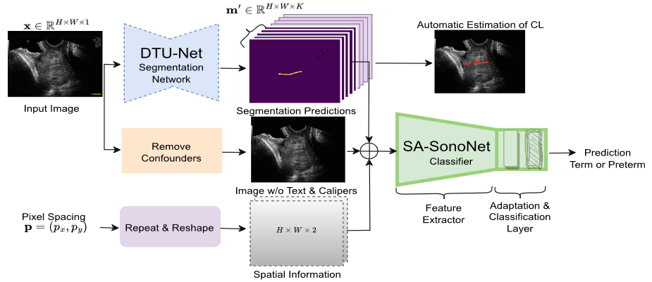

# Leveraging Shape and Spatial Information for Spontaneous Preterm Birth Prediction

[Paraskevas Pegios](https://scholar.google.com/citations?user=LVACmX4AAAAJ&hl=en&oi=ao), [Emilie Pi Fogtmann Sejer](https://scholar.google.com/citations?user=NHOOZJQAAAAJ&hl=en&oi=ao), [Manxi Lin](https://scholar.google.com/citations?user=RApnUsEAAAAJ&hl=en&oi=ao), [Zahra Bashir](https://scholar.google.com/citations?user=0zqLt7oAAAAJ&hl=en&oi=ao), [Morten Bo Søndergaard Svendsen](https://scholar.google.com/citations?user=U7YuapkAAAAJ&hl=en&oi=ao), [Mads Nielsen](https://scholar.google.com/citations?user=2QCJXEkAAAAJ&hl=en&oi=ao), [Eike Petersen](https://scholar.google.com/citations?user=juRQtRgAAAAJ&hl=en&oi=ao), [Anders Nymark Christensen](https://scholar.google.com/citations?user=bkWG4OYAAAAJ&hl=en&oi=ao), [Martin Tolsgaard](https://scholar.google.com/citations?user=SVu_X0sAAAAJ&hl=en&oi=ao), [Aasa Feragen](https://scholar.google.com/citations?user=MNDVpoUAAAAJ&hl=en&oi=ao)

[[ASMUS @ MICCAI 2023 Best Paper Honorable Mention]](https://link.springer.com/chapter/10.1007/978-3-031-44521-7_6)



## Abstract
Spontaneous preterm birth prediction from transvaginal ultrasound images is a challenging task of profound interest in gynecological obstetrics. Existing works are often validated on small datasets and may lack validation of model calibration and interpretation. In this paper, we present a comprehensive study of methods for predicting preterm birth from transvaginal ultrasound using a large clinical dataset. We propose a shape- and spatially-aware network that leverages segmentation predictions and pixel spacing information as additional input to enhance predictions. Our model demonstrates competitive performance on our benchmark, providing additional interpretation and achieving the highest performance across both clinical and machine learning baselines. Through our evaluation, we provide additional insights which we hope may lead to more accurate predictions of preterm births going forwards.

## Citation

If you found useful our code, please cite our work.

```bibtex
@inproceedings{pegios2023leveraging,
  title={Leveraging Shape and Spatial Information for Spontaneous Preterm Birth Prediction},
  author={Pegios, Paraskevas and Sejer, Emilie Pi Fogtmann and Lin, Manxi and Bashir, Zahra and Svendsen, Morten Bo S{\o}ndergaard and Nielsen, Mads and Petersen, Eike and Christensen, Anders Nymark and Tolsgaard, Martin and Feragen, Aasa},
  booktitle={International Workshop on Advances in Simplifying Medical Ultrasound},
  pages={57--67},
  year={2023},
  organization={Springer}
}
```

## SA-SonoNet for Spontaneous Preterm Birth Prediction

Original Pytroch implementation for SA-SonoNet can be found in src/models/sasononet.py

```python
class SASonoNetModel(nn.Module):
    """
    Official PyTorch implementation of SA-SonoNet
    Paraskevas Pegios et al.
    Leveraging Shape and Spatial Information for Spontaneous Preterm Birth Prediction
    """
    def __init__(
        self, 
        config='SN32', num_labels=1, in_channels=8,
        dtunet_checkpoint='/home/ppar/SA-SonoNet-sPTB/src/models/weights/dtunet/model.t7',
        device='cpu',
    ):
        super(SASonoNetModel, self).__init__()

        # DTU-Net trained on an external multi-class segmentation dataset with L = 14 structures
        dtunet = DTUNet(in_channels=1, out_channels=14).to(torch.device(device))
        # load DTU-Net weights
        dtunet.load_state_dict(torch.load(dtunet_checkpoint,  map_location=torch.device(device)))
        # fix trained DTU-Net
        for name, param in dtunet.named_parameters():
            param.requires_grad = False

        self.dtunet_checkpoint = dtunet_checkpoint      
        self.dtunet = dtunet
        self.num_labels = num_labels

        # initialize feature extractor SA-SonoNet with pre-trained SonoNet weights
        channels = int(FEAT_CHANNELS[config])
        self.feature_extractor = sononet_extractor(config=config, 
                                 in_channels=in_channels, 
                                 num_labels=num_labels
        )

        # adapation layer for the classification task
        self.adaption = nn.Sequential(
                         nn.Conv2d(channels,
                                   channels // 2, 1, bias=False),
                         nn.BatchNorm2d(channels // 2),
                         nn.ReLU(inplace=True),
                         nn.Conv2d(channels // 2, num_labels, 1, bias=False),
                         nn.BatchNorm2d(num_labels),
        )

    def forward(self, inputs):

        self.dtunet.eval()

        # raw input image
        image_with_calipers = inputs['image_with_calipers']
        # input image without confounders (text & calipers)
        image = inputs['image']
        # spatial information: pixel spacing 
        spacing = inputs['spacing']

        # shape information: segmentation predictions 
        with torch.no_grad():
            segmentation_logits = self.dtunet({'image':image_with_calipers})['logit']
            # cervical shape information: keep only segmentations relevant for the task (K = 5)
            segmentation_logits = segmentation_logits[:, :5, : ,: ].detach()
        
        # combine image, shape and spatial information
        x = torch.cat((image, segmentation_logits, spacing), dim=1)
        
        # feature extractor
        features = self.feature_extractor(x)
        # adaptation layer
        adapt = self.adaption(features)
        # classification layer
        logit = F.avg_pool2d(adapt, adapt.size()[2:]).view(adapt.size(0), -1)
        
        # output risk score, features, and DTU-Net segmentation mask (used for CL estimates and feedback)
        return {'logit': logit, 
                'features': features,
                'mask': segmentation_logits,
        }
```

## Installation
```bash
conda create -n sa-sononet python=3.8
conda activate sa-sononet
conda install pytorch==1.13.1 torchvision==0.14.1 pytorch-cuda=11.7 -c pytorch -c nvidia
pip install -r requirements.txt
```

## Data & trained DTU-Net segmentation model 
Since we cannot re-distribute datasets and model weights due to privacy concerns, manual action is required. SA-SonoNet assumes access to a trained segmentation network – in our experiments, the DTU-Net, which is specialized in segmenting curvilinear structures. To train DTU-Net on your dataset please refer to DTU-Net's [original implementation](https://github.com/mmmmimic/DTU-Net). We handle our datasets and dataloaders using csv files, stored in a parent folder 'metadata', with paths to ultrasound images and the corresponding relevant information such as patient or ultrasound machine information. Please follow the pre-processing steps outlined below to prepare the necessary metadata csv files for training and evaluating SA-SonoNet on your datasets as well as other baselines.

## Pre-processing

### Retrieve pixel spacing and other information from dicom files

```bash
python -m src.preprocessing.pixel_spacing --csv path/to/csv
```

### Remove confounders from fetal ultrasound dicom images

```bash
python -m src.preprocessing.remove_confounders --csv path/to/csv --root root/path/to/save/images
```

### Get segmentation predictions and cervical length (CL) estimates using a trained DTU-Net

```bash
python -m src.preprocessing.segmentation_predictions --csv path/to/csv --checkpoint path/to/dtunet/checkpoint
```

### Create data splits ensuring non-overlapping patients and evalute CL predictions across all splits

```bash
python -m src.preprocessing.data_splits --csv_preterm /path/to/preterm/images --csv_term /path/to/term/images --stratify_by ga_in_weeks --n_splits 5 --save --eval
```

### Extract and save handcrafted textural features for the TextureNet baseline model 

```bash
python -m src.preprocessing.handcrafted_features --csv path/to/csv
```

## Training

Train SA-SonoNet and the baselines TextureNet and MT-UNet by simply running the following script.

```bash
sh train.sh
```

## Evaluation across splits for SA-SonoNet and baselines (TextureNet and MT-UNet)

Assumes that you save your logs in a parent folder 'models'.
```bash
python -m src.pretermbirth_model_eval --path models/sa-sononet
python -m src.pretermbirth_model_eval --path models/texturenet
python -m src.pretermbirth_model_eval --path models/mu-unet
```

## Inference
```bash
python -m src.sasononet_inference
```